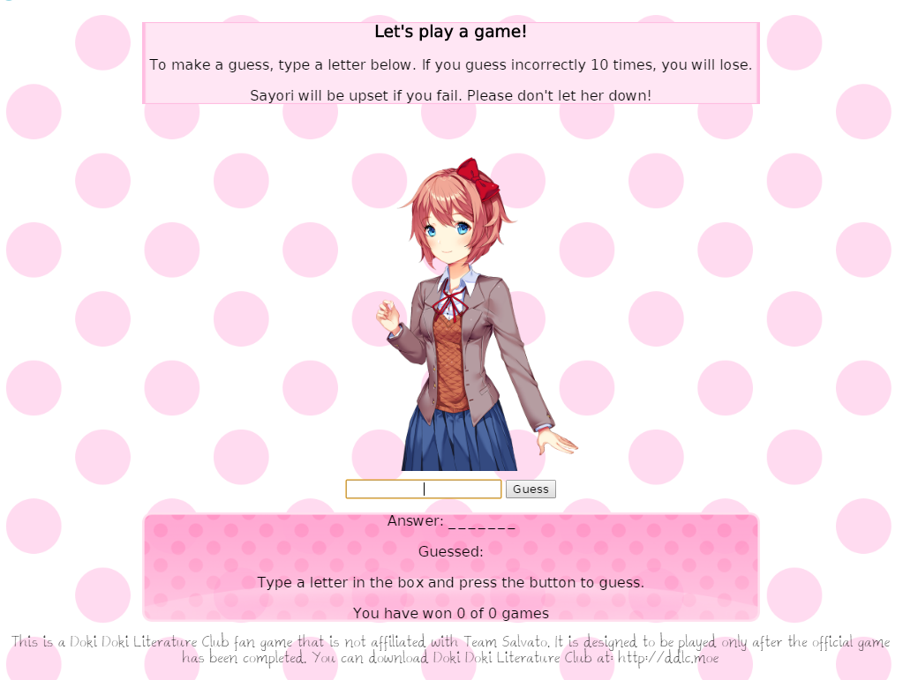

# Hangman v0.2.0

This is a simple hangman app based on the popular game Doki Doki Literature Club. It has only been tested on Windows, and there is no guarantee it will work on other Operating Systems.

# For Players

The current installer can be found at https://github.com/jepurcell/hangman/releases/tag/v0.2.0

# For Developers

## Setup

First, make sure you have node and npm installed. If your version of node is not compatible with this program, consider using nvm.

From the project directory, run `npm install`.

## Running

To launch the application, run `npm start`.

To run unit tests, run `npm test`.

## Building

To create a build, run `npm run build`.

### Changelog
- 0.2.0
  - Added a script to build an installer for Windows
  - Repackaged the game as a stand-alone electron application instead of an express server
  - Added some new assets
  - Added the following statement to the game: "This is a Doki Doki Literature Club fan game that is not affiliated with Team Salvato. It is designed to be played only after the official game has been completed. You can download Doki Doki Literature Club at: http://ddlc.moe"

- 0.1.0
  - The game has been reskinned using assets from Doki Doki Literature Club, a game developed by Team Salvato. Doki Doki Literature Club is a psychological horror game disguised as a visual novel, and has won numerous awards. You can read more here: `http://teamsalvato.com/`

- 0.0.5
  - Changed the rules such that guesses are no longer incremented when repeat letters, multiple characters, or non-alphabetic characters are guessed.
  - Set the guess input to autofocus on page load
  - Added thin whitespace characters to the displayed answer to increase readability
  - Now displaying correct answer on game loss
  - Added some unit tests for core functionality using Mocha and Chai

- 0.0.4
  - Added persistent game functionality
  - Fixed a bug that was causing uppercase and lowercase to be treated differently
  - Added basic style to the body
  - Added autofocus on game finish / restart

- 0.0.3
  - Refactored code for readability
  - Added restart functionality and statistics tracking

- 0.0.2
  - Noticed that all game logic was visible in browser dev tools, scrapped project and restarted with `express`
  - Added lint rules for code consistency

- 0.0.1
  - Created basic game using `http-server` npm module
